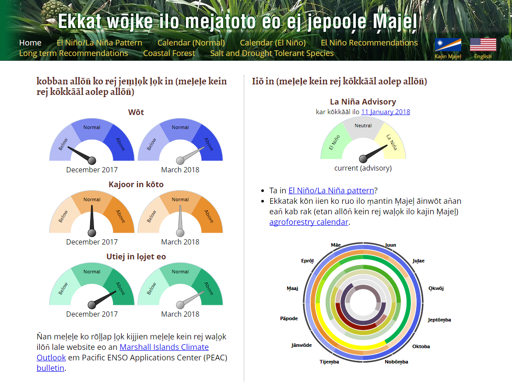
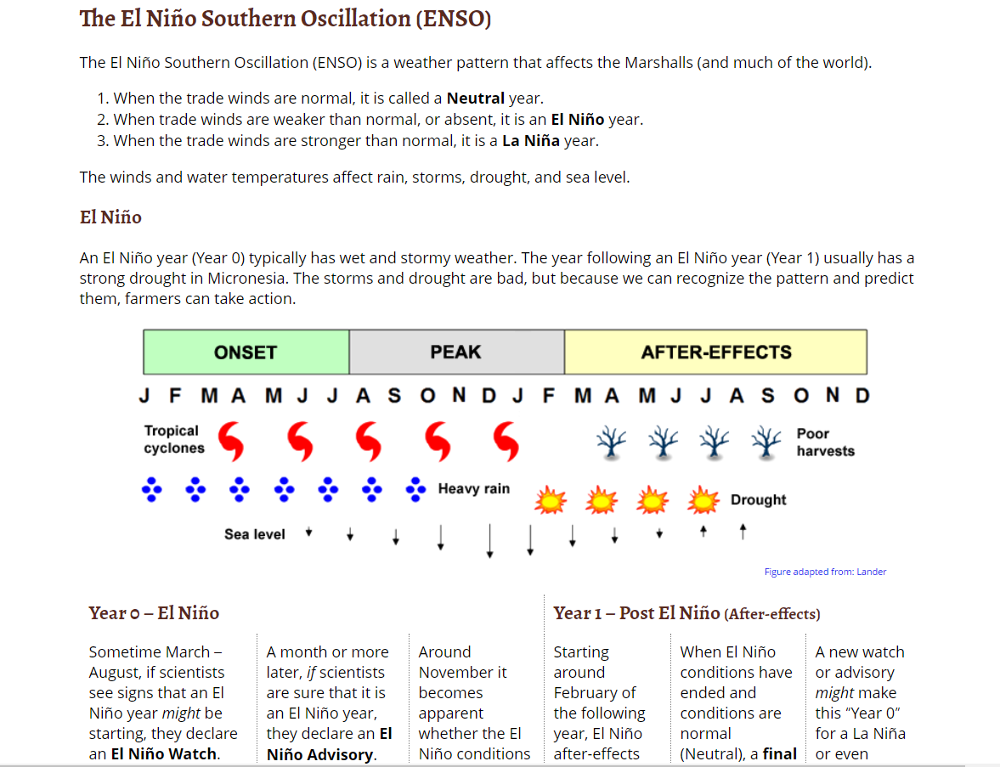

This website is used to represent agricultural data for the Marshall Islands. This would provide information for people such as local farmers in the Marshall Islands who may be concerned with thier crops for certain periods of the season. The project is currently held at the Pacific Islands Ocean Observing System server at <a href="http://www.pacioos.hawaii.edu/">www.pacioos.hawaii.edu</a>. The final goal of the project is to the move the website to the servers at the College of the Marshall Islands.

As a part-time job as a web developer at RCUH I was responsible for maintaining and updating contents for the Agroforestry Website. My role for the project was to take any content sent by my supervisors and add to the site as html content. If there was any functionality that need to to be implemented into the site, I was responsible for puting those in. In one such case I was tasked to put in some sort of a translation language switcher. I did this by putting in a php script to change the url to point to different files that had the right translation depending on which button the user clicked. This would then stay in attached to the url letting the server know which files it needed to serve.

With this site I learned to take an existing project and see how it works by reading past code from previous developers. This helped me gain experience working on projects that were, for the most part, already set in place. This also taught me to make sure to put in code that other developers can easily understand and pick up form where I left off.

You may visit the site at <a href="http://oos.soest.hawaii.edu/pacific-rcc/Marshalls%20Agroforestry/site/">Agroforestry Site</a>
