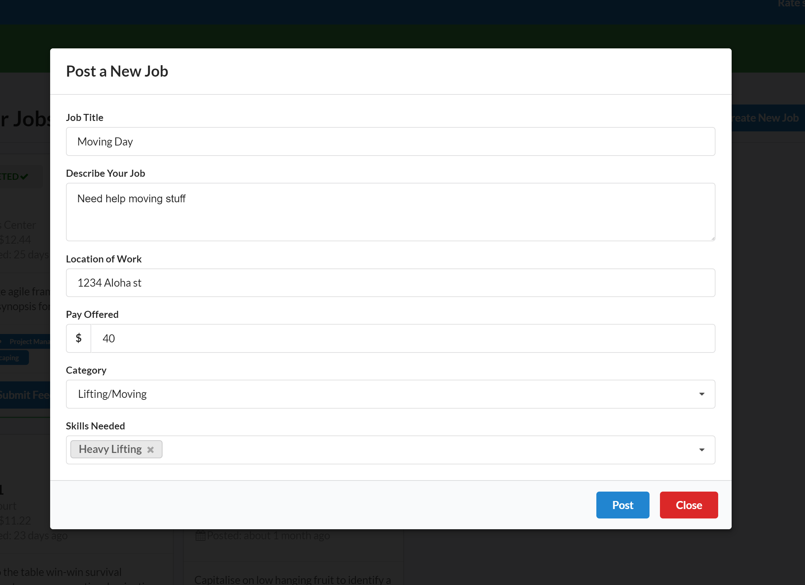
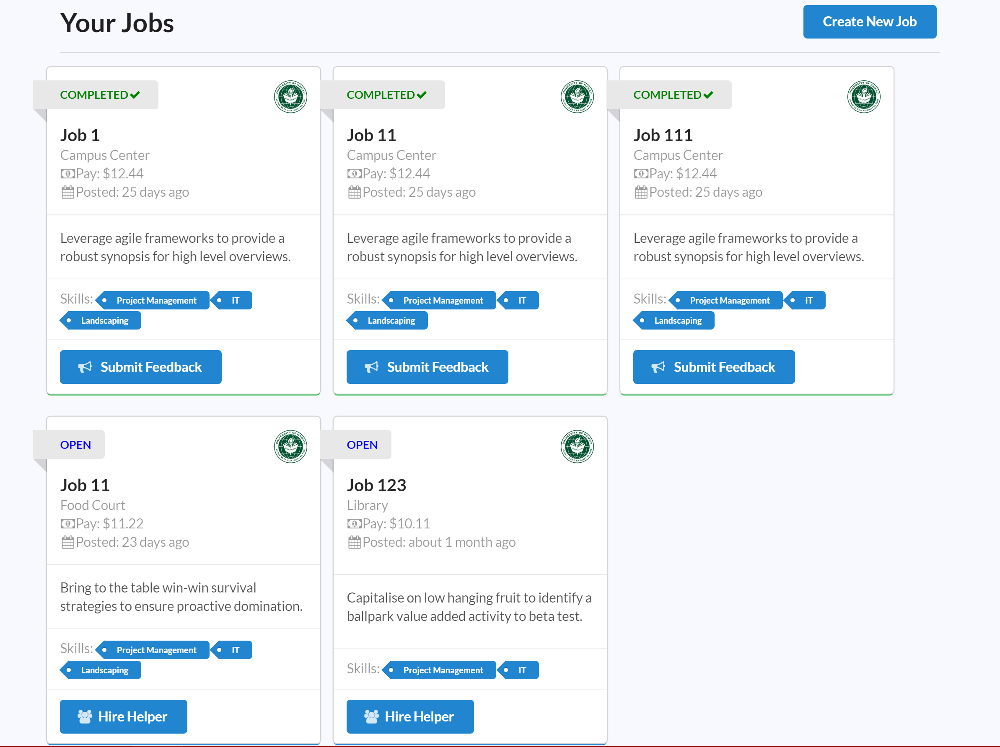
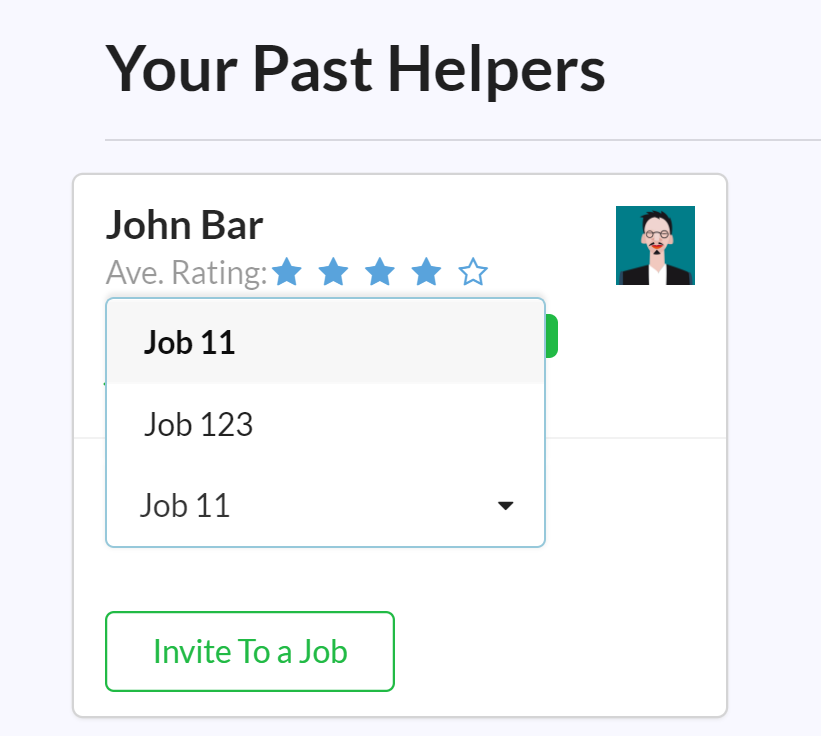

## About
This project was created by my class group and I for our final project in ICS 314. The Small Kine Jobs app will be used to help students who would like to find short term employment. Reasons for needing short term employment could be: The student is only at the University for a year or less, a student needing quick cash, or even if an employer needs an employee for a short period of time. This app would provide a quick and easy outlet to find an employer/employee without having to go to a temporary job agency, which can sometimes have long replying periods or sometimes too many applicants. Most importantly the app is specific for UH students, who already have the financial burden of funding their education.

## Development
Within our project we used Github to divide up the tasks that were needed to be completed. We created an organization and each of us forked the project to our local development. When an issue was completed we would then issue a pull request which would then be reviewed by one of the other memebers to approval.

I contributed to the project by lending my experience in previous web development. I was able to create multiple components and api's that were needed to wire up the app job and user logic. Between creating components and fixing any bugs I would also help my fellow team members on any issues they were having.

## Learning Experience
This project has given me better experience when coding with a team. I've learned how to use git properly and more efficiently. Where as before I would code on a project myself and fix bugs that I have created, this has taught me how to work with others and review their code and collaborate with them on any issues that arose during our development process.

Source: <a href="https://smallkinejobs.github.io/"><i class="large github icon "></i>Small Kine Jobs GitHub Page</a>
Application Demo: <a href="https://smallkinejobs.meteorapp.com">SmallKineJobs</a>
